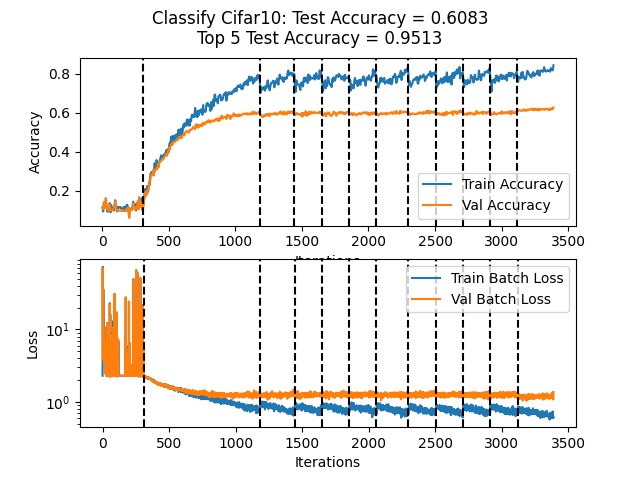

- Setup Virtual Enviroment (if you want).

- Install Requirements and Data with ``` ./setup.sh ```
    - You may have to run ``` chmod +x ./setup.sh ``` first.

- Run an example in the ``` ./runners ``` directory. e.g. ``` main.py ./runners/classify_cifar10.py ```.
    - Change parameters in the ``` configs ``` directory (or create your own).

- View the results in ``` ./artifacts ```.

# CIFAR 10/100 Experiments
- At first i had my max pool inside my resblock, and to match shapes I also max pooled my shortcut. I'm not sure if that was better or worse but it felt weird
- At first i also put my skip connection after the mlp by also flattening the skip connection, that was even weirder.
- My Augmentation used to get applied on the batch, aka on the go using a for loop. That was really slow, so i instead compromised space for time and applied it on the whole dataset at once.
- My architecture was very random before but now i'm doing an inspiration of resnet-50
- My desired spec for cifar10 is 93% accuracy, and for cifar100 is 90% top 5 accuracy from reading papers with similar architectures. However, i did not reach those specs.
- Plots for some (no where near all) of my attempts can be found in the ``` ./artifacts ``` directory. Accompanying them in the same folder are the configs used to generate them. The title of the plots include my test accuracy, and top 5 test accuracy.

## These are my best attempts at cifar10


## This is my best attempt at cifar100

