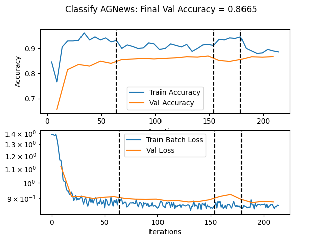

- Setup Virtual Enviroment (if you want).

- Install Requirements and Data with ``` ./setup.sh ```
    - You may have to run ``` chmod +x ./setup.sh ``` first.

- Run an example in the ``` ./runners ``` directory. e.g. ``` main.py ./runners/classify_cifar10.py ```.
    - Change parameters in the ``` configs ``` directory (or create your own).

- View the results in ``` ./artifacts ```.

## This is my best attempt at agNews


## My accuracy was 86.76% on the test set

