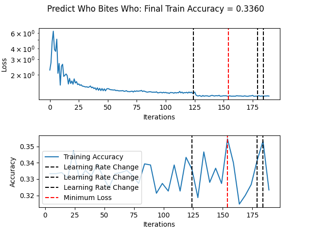

- Setup Virtual Enviroment (Recommended).

- Install Requirements and Data with ``` ./setup ```
    - You may have to run ``` chmod +x ./setup ``` first.

- Train a model in the ``` ./runners ``` directory. e.g. ``` train.py ./runners/classify_cifar10.py ```.
    - Change parameters in the ``` configs ``` directory (or create your own).

- Test the model. e.g. ``` test.py ./runners/classify_cifar10.py ```.

- View the results in ``` ./artifacts ```.

# Transformer Assignment
I overfit on my very own dataset of over 300 possible biters and bitees. Each biter bites one and only bitee and no single bitee is bit by more than one biter. This revolutionary dataset can be found in ``` ./data/who_bites_who.txt ```. The training plot is shown below.

