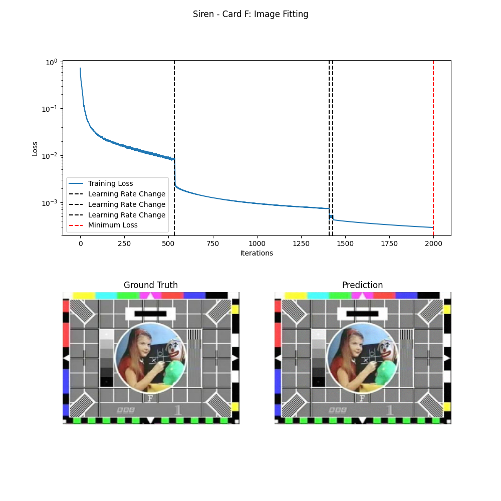
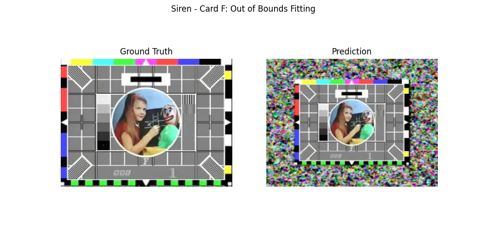
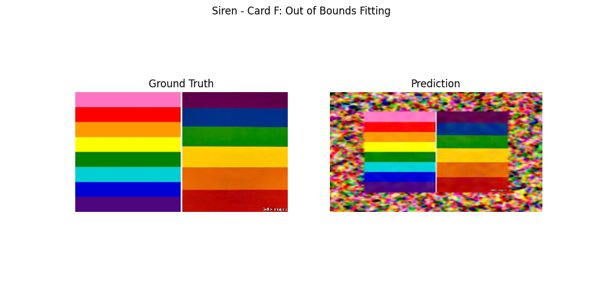

- Setup Virtual Enviroment (Recommended).

- Install Requirements and Data with ``` ./setup ```
    - You may have to run ``` chmod +x ./setup ``` first.

- Train a model in the ``` ./runners ``` directory. e.g. ``` train.py ./runners/classify_cifar10.py ```.
    - Change parameters in the ``` configs ``` directory (or create your own).

- Test the model. e.g. ``` test.py ./runners/classify_cifar10.py ```.

- View the results in ``` ./artifacts ```.

# Siren
Below is my result which was trained with ```./runners/siren_mlp.py```. The model never actually stopped automatically and was instead stopped by my maximum iteration hyperparameter. It had a final loss of 0.0003 and would likely have continued to decrease as shown by the red vertical line at the very end.



### Creative endeavers
I tested out the siren's out of bounds abilities. This can be run by running ``` test.py ./runners/image_fit_card_f.py ``` The result is shown below.



I thought that looked pretty awful so I tried it again after training with this rainbow image to see if it would work better with something that has repeating patterns in one direction.



That also failed miserably but at least the colors match the theme. This can be a very overkill solution to getting a color palette from an image. It is at least good that it correctly displayed the picture in the middle. Since none of those coordinates were actually in the training set, it means the model is at least good at interpolating between points.

I spent a really long time trying to fit an stl file (specifically the frog that was hidden around the school), but I kept running out of memory. When I did it with a very low resolution version of the file it worked but the predicted mesh looked like a gobbly gook mess of vertices. The paper did something very similar so i know it's possible, but I must have been doing something wrong :(