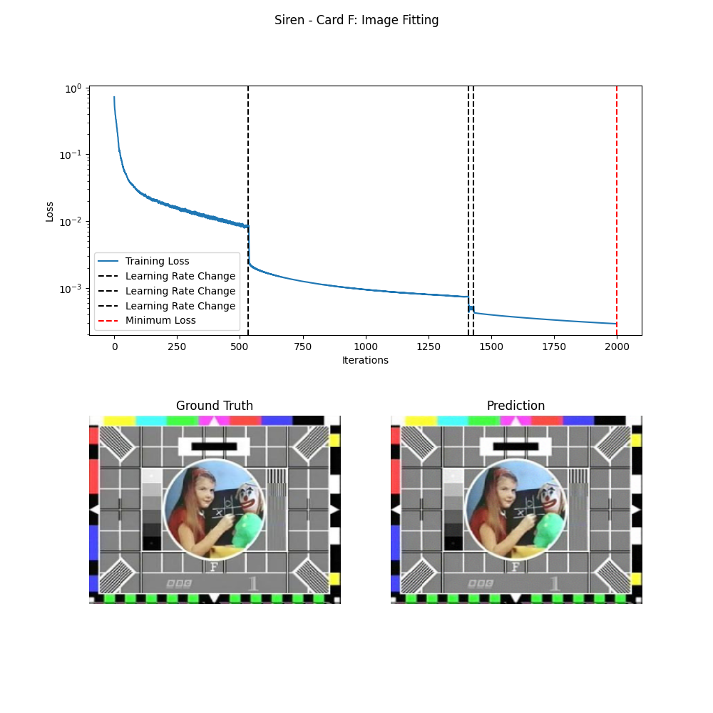

- Setup Virtual Enviroment (Recommended).

- Install Requirements and Data with ``` ./setup ```
    - You may have to run ``` chmod +x ./setup ``` first.

- Train a model in the ``` ./runners ``` directory. e.g. ``` train.py ./runners/classify_cifar10.py ```.
    - Change parameters in the ``` configs ``` directory (or create your own).

- Test the model. e.g. ``` test.py ./runners/classify_cifar10.py ```.

- View the results in ``` ./artifacts ```.

# Siren
Below is my result which was trained with ```./runners/siren_mlp.py```. The model never actually stopped automatically and was instead stopped by my maximum iteration hyperparameter. It had a final loss of 0.0003 and would likely have continued to decrease as shown by the red vertical line at the very end.



### Creative endeavers